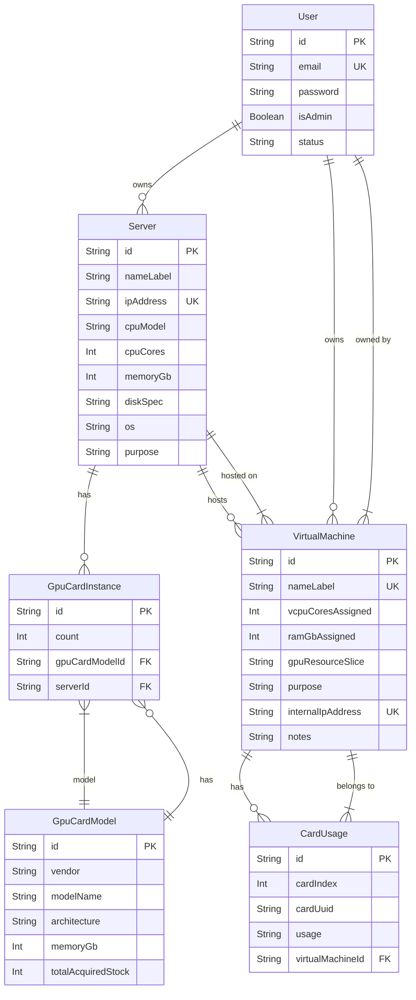

# Database Entity-Relationship Diagram (ERD)

This document describes the database schema for the GPU Management Console project and includes a visual representation using a Mermaid ER diagram.

## Entities

## Entity-Relationship Diagram (ERD)

### Entity Descriptions

#### `User`

Represents a user of the GPU Management Console.

| Field      | Type     | Description                                  |
| :--------- | :------- | :------------------------------------------- |
| `id`       | `String` | Primary key, unique identifier.             |
| `email`    | `String` | User's email address, must be unique.        |
| `password` | `String` | User's password.                             |
| `isAdmin`  | `Boolean` | Indicates if the user has admin privileges.  |
| `status`   | `String` | User's status.                               |

#### `Server`

Represents a physical or virtual server being managed.

| Field           | Type     | Description                                  |
| :-------------- | :------- | :------------------------------------------- |
| `id`            | `String` | Primary key, unique identifier.             |
| `nameLabel`     | `String` | Human-readable name or label for the server. |
| `ipAddress`     | `String` | IP address of the server, must be unique.    |
| `cpuModel`      | `String` | CPU model of the server.                     |
| `cpuCores`      | `Int`    | Number of CPU cores.                         |
| `memoryGb`      | `Int`    | Amount of RAM in GB.                         |
| `diskSpec`      | `String` | Disk specification.                          |
| `os`            | `String` | Operating system.                            |
| `purpose`       | `String` | Purpose or description of the server.        |

#### `GpuCardModel`

Represents a GPU card model.

| Field         | Type     | Description                       |
| :------------ | :------- | :--------------------------------- |
| `id`          | `String` | Primary key, unique identifier.    |
| `vendor`      | `String` | Vendor of the GPU card.            |
| `modelName`   | `String` | Model name of the GPU card.        |
| `architecture`| `String` | Architecture of the GPU card.      |
| `memoryGb`    | `Int`    | Memory of the GPU card in GB.      |

#### `GpuCardInstance`

Represents an instance of a GPU card within a server.

| Field           | Type     | Description                                  |
| :-------------- | :------- | :------------------------------------------- |
| `id`            | `String` | Primary key, unique identifier.              |
| `count`         | `Int`    | Number of GPU card instances.                |
| `gpuCardModelId`| `String` | Foreign key referencing the `GpuCardModel`.   |
| `serverId`      | `String` | Foreign key referencing the `Server`.        |

#### `VirtualMachine`

Represents a virtual machine running on a server.

| Field              | Type     | Description                                  |
| :----------------- | :------- | :------------------------------------------- |
| `id`               | `String` | Primary key, unique identifier.              |
| `nameLabel`        | `String` | Human-readable name or label for the VM.     |
| `hostServerId`     | `String` | Foreign key referencing the host `Server`.    |
| `userId`           | `String` | Foreign key referencing the `User`.          |
| `vcpuCoresAssigned`| `Int`    | Number of assigned vCPU cores.               |
| `ramGbAssigned`    | `Int`    | Assigned RAM in GB.                          |
| `gpuResourceSlice`| `String` | GPU resource slice.                          |
| `purpose`          | `String` | Purpose or description of the VM.            |
| `internalIpAddress`| `String` | Internal IP address of the VM.               |
| `notes`            | `String` | Additional notes about the VM.               |

#### `CardUsage`

Represents the usage of a GPU card by a virtual machine.

| Field              | Type     | Description                                  |
| :----------------- | :------- | :------------------------------------------- |
| `id`               | `String` | Primary key, unique identifier.              |
| `cardIndex`        | `Int`    | Index of the GPU card.                       |
| `cardUuid`         | `String` | UUID of the GPU card.                        |
| `usage`            | `String` | Usage details of the GPU card.              |
| `virtualMachineId`| `String` | Foreign key referencing the `VirtualMachine`.|
